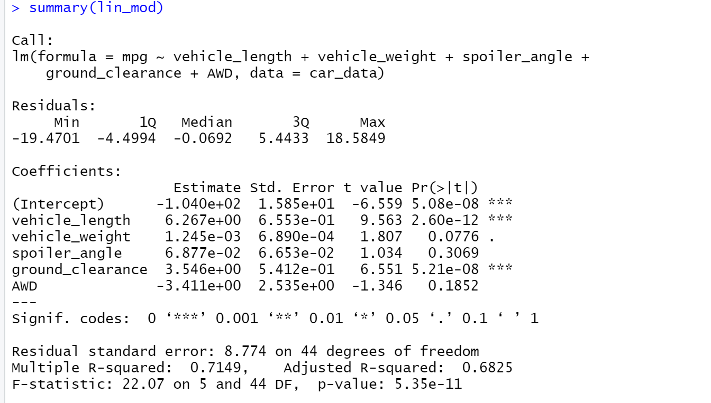

# MechaCar_Statistical_Analysis

- Which variables/coefficients provided a non-random amount of variance to the mpg values in the dataset?:
The variables/coefficients are vehicle lngth and ground clearance.

- Is the slope of the linear model considered to be zero? Why or why not?:
The slopes of the vehicle weight and spoiler angle are nearly zeeo because they don't impact the miles per gallon.

- Does this linear model predict mpg of MechaCar prototypes effectively? Why or why not?: This linear model does predict effectly because 0.71 is close to 100.
  